# 7本撚線パイプ — 視角別投影

[<- README](../../../README.md) | [<- gallery](../../gallery.md)

> 7strand の視角別2D投影ギャラリー（時間ステップなし、視野違いのみ）

## 総合マルチビュー

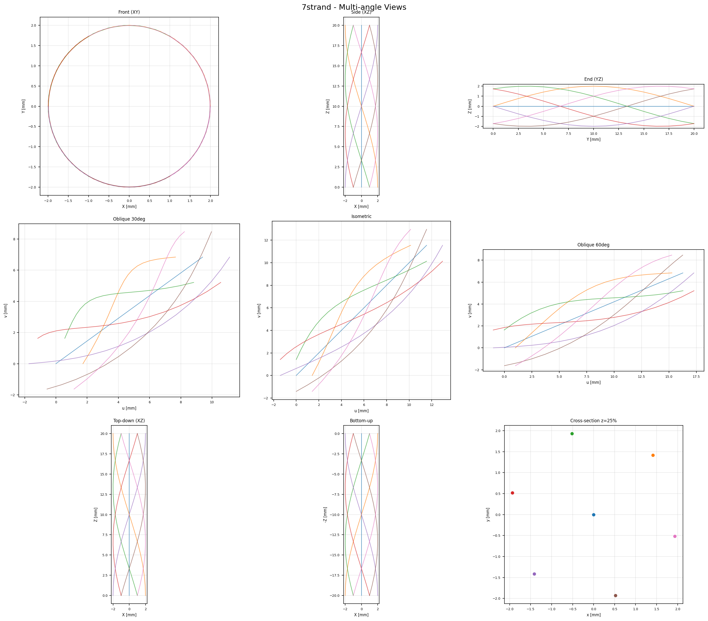

## 個別視角

### Front (XY)

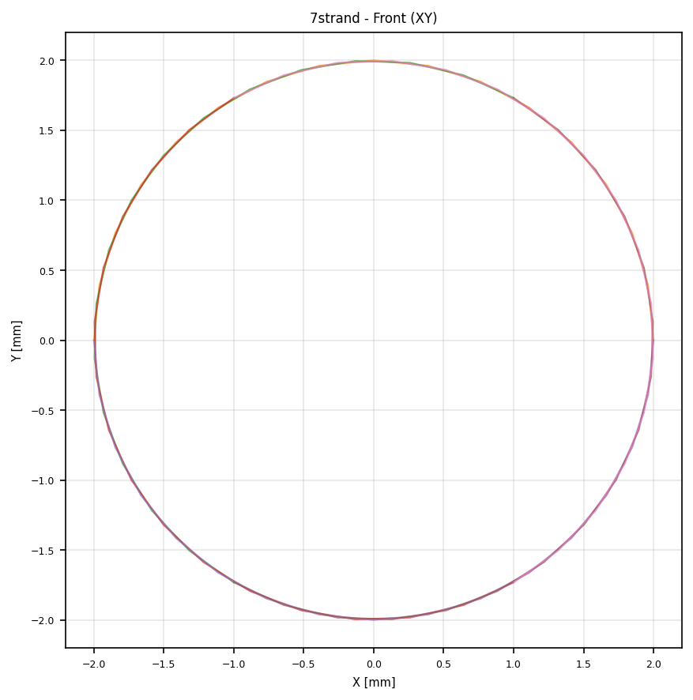

### Side (XZ)

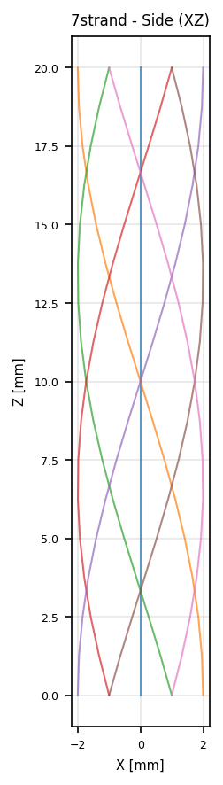

### End (YZ)

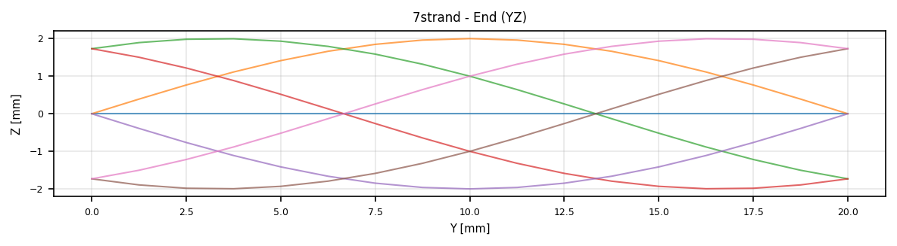

### Oblique 30deg

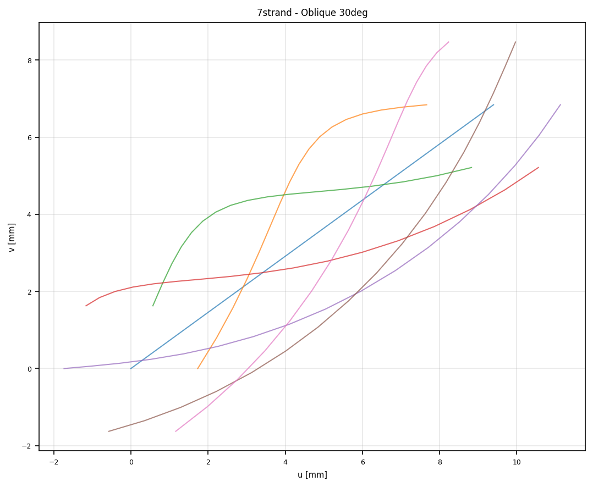

### Isometric

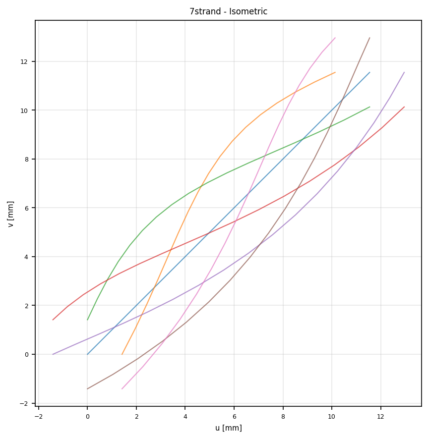

### Oblique 60deg

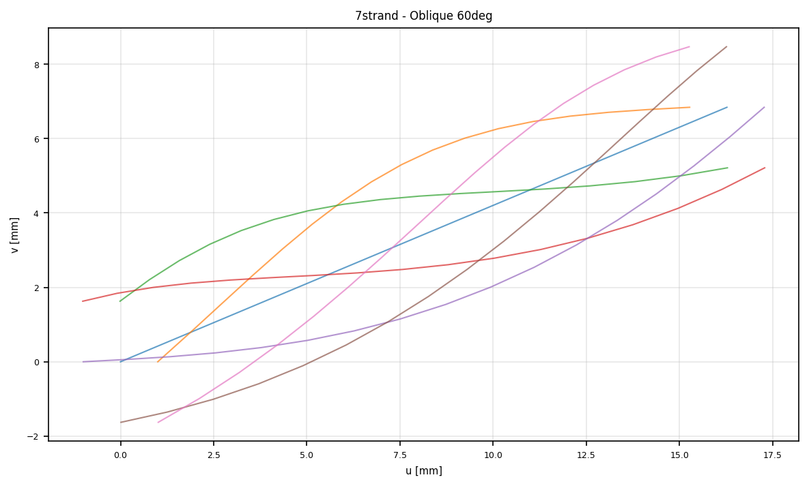

### Top-down (XZ)

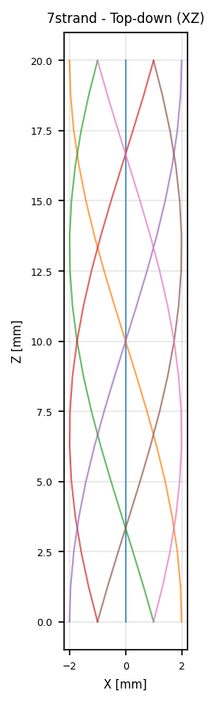

### Bottom-up

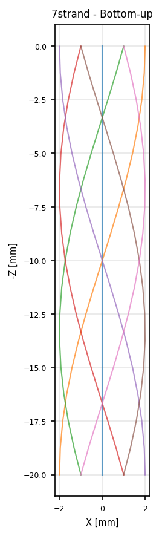

### Cross-section z25

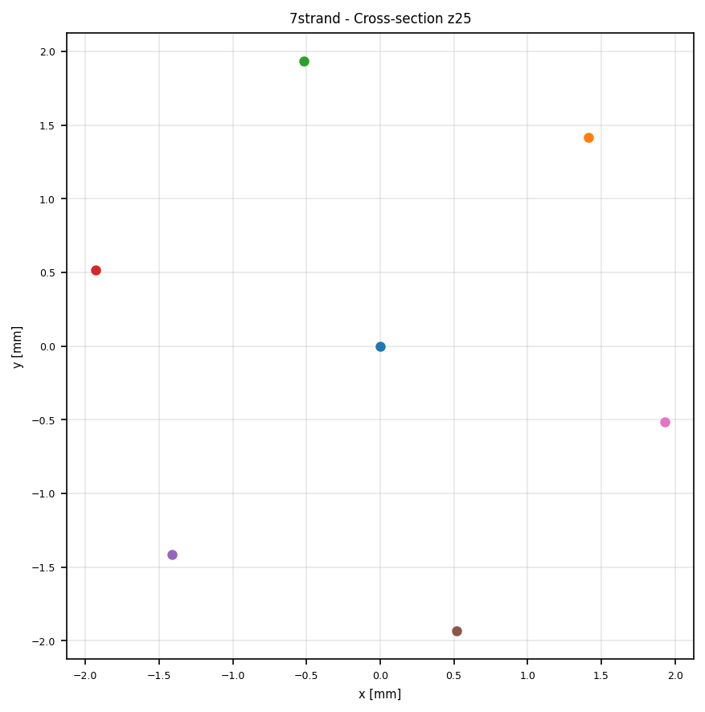

### Cross-section z50

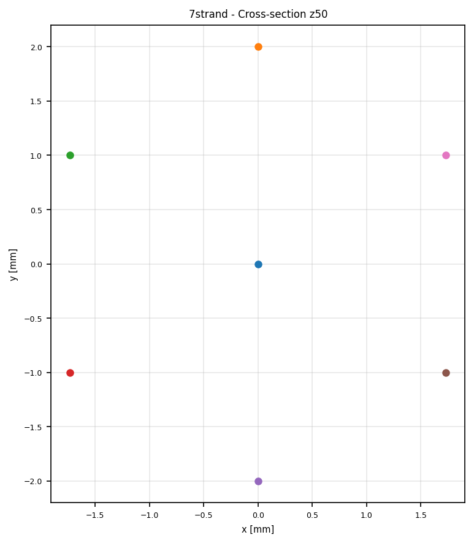

### Cross-section z75

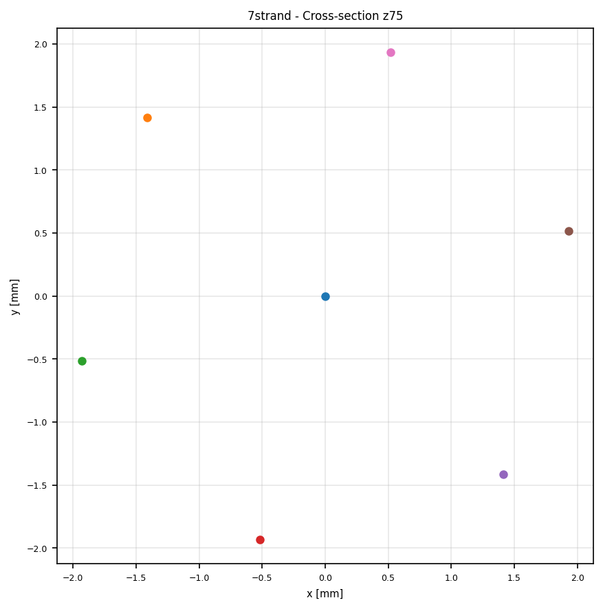
