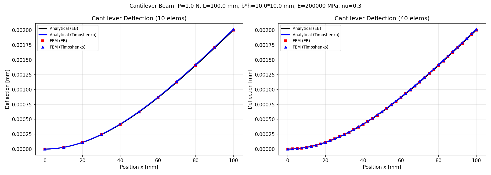
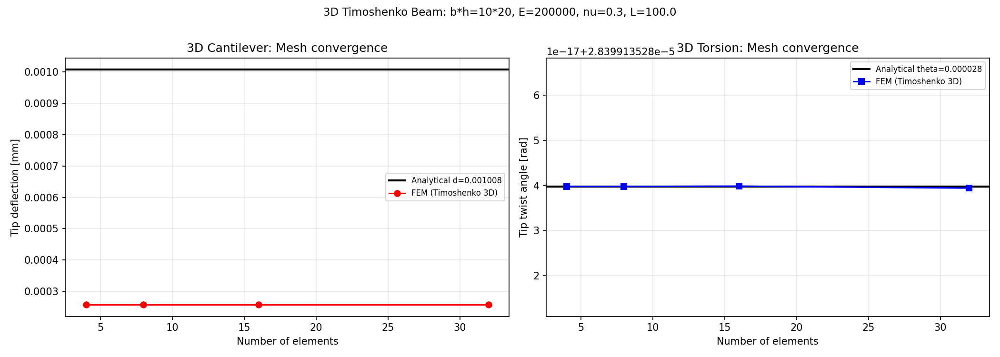
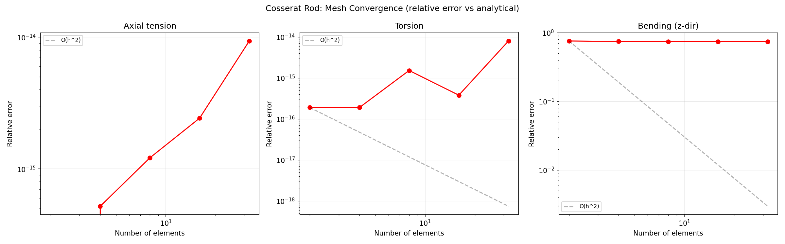
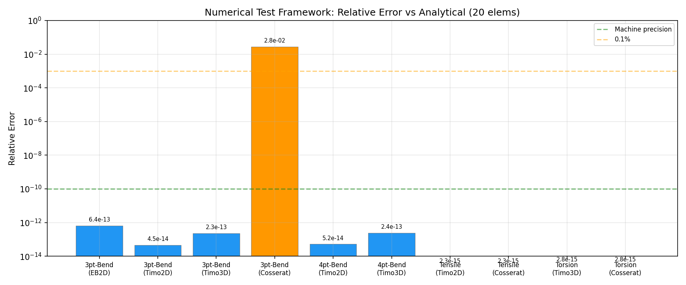
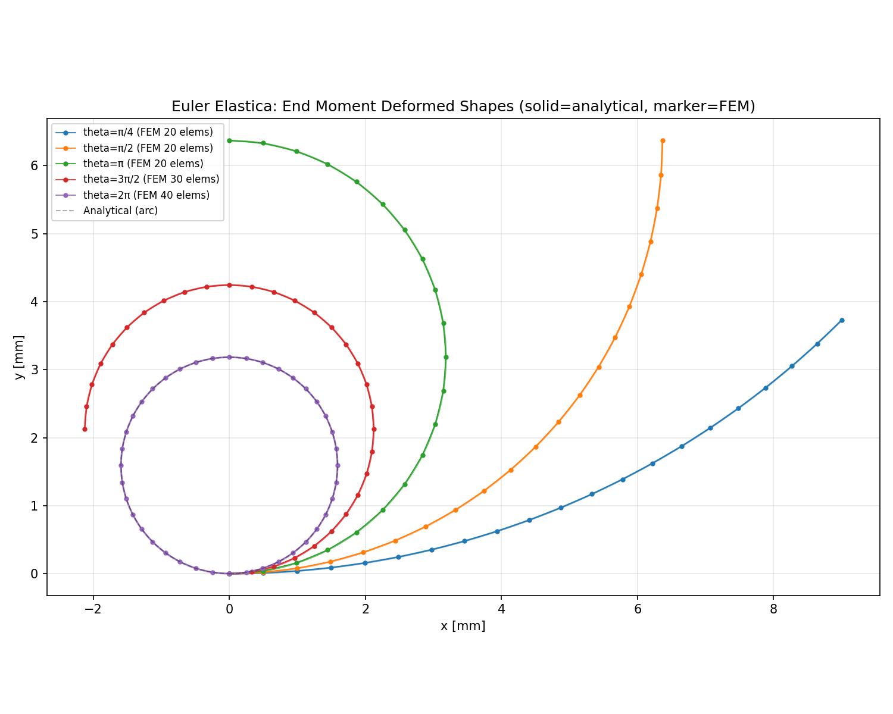
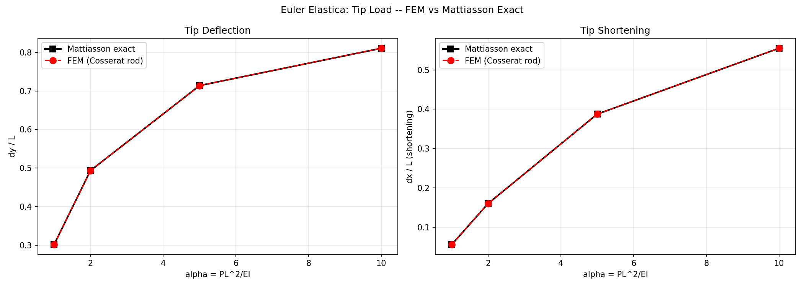
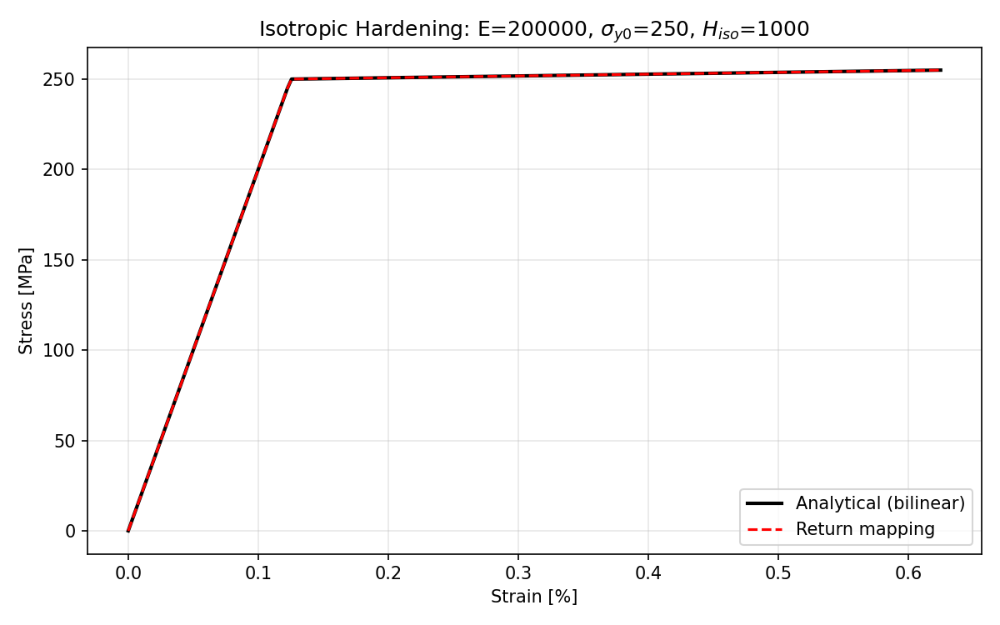
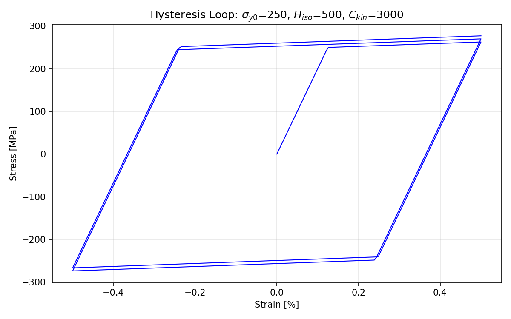
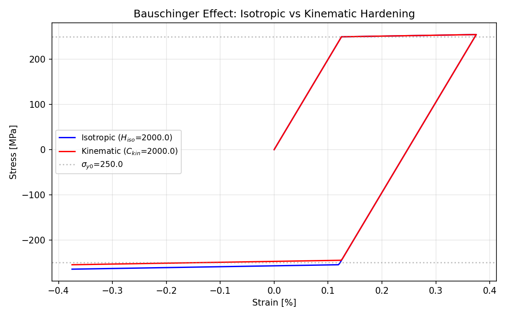
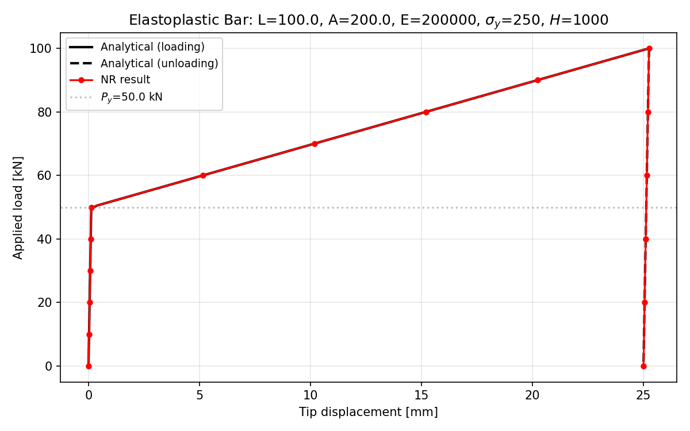

# xkep-cae バリデーション文書

[← README](../../README.md)

本文書は xkep-cae の全バリデーションテストの一覧、解析解・厳密解との比較方法、および検証結果をまとめたものである。
CAE ソフトウェアの品質保証における重要な資産として、今後のバリデーションテスト追加時にも同様の形式で文書化する。

## 目次

- [1. 梁要素（Phase 2.1–2.2）](#1-梁要素phase-2122)
- [2. 3D Timoshenko 梁（Phase 2.3）](#2-3d-timoshenko-梁phase-23)
- [3. Cosserat rod 要素（Phase 2.5）](#3-cosserat-rod-要素phase-25)
- [4. 数値試験フレームワーク（Phase 2.6）](#4-数値試験フレームワークphase-26)
- [5. Euler Elastica — 幾何学的非線形（Phase 3）](#5-euler-elastica--幾何学的非線形phase-3)
- [6. 弧長法（Phase 3）](#6-弧長法phase-3)
- [7. 1D 弾塑性構成則（Phase 4.1）](#7-1d-弾塑性構成則phase-41)
- [8. 2D 連続体要素（Phase 1）](#8-2d-連続体要素phase-1)
- [検証図の生成方法](#検証図の生成方法)
- [テスト実行方法](#テスト実行方法)

---

## 1. 梁要素（Phase 2.1–2.2）

### 1.1 Euler-Bernoulli 2D 梁

**テストファイル**: `tests/test_beam_eb2d.py`

| テスト名 | 解析解 | 許容誤差 |
|----------|--------|----------|
| 片持ち梁先端集中荷重 | δ = PL³/(3EI), θ = PL²/(2EI) | 相対誤差 < 10⁻¹⁰ |
| 片持ち梁等分布荷重 | δ = qL⁴/(8EI), θ = qL³/(6EI) | 相対誤差 < 10⁻¹⁰ |
| 断面力 | V = P, M(x) = P(L−x) | 完全一致 |

**解析解の導出**:
Euler-Bernoulli 梁理論 EI·y'' = M(x) の直接積分。せん断変形を無視するため、
細長い梁（L/h ≫ 1）では厳密解と一致する。2次要素（Hermite 補間）を用いているため、
曲げの3次多項式解を正確に再現し、1要素でも厳密解に一致する。

### 1.2 Timoshenko 2D 梁

**テストファイル**: `tests/test_beam_timo2d.py`

| テスト名 | 解析解 | 許容誤差 |
|----------|--------|----------|
| 片持ち梁先端集中荷重 | δ = PL³/(3EI) + PL/(κGA) | 相対誤差 < 10⁻¹⁰ |
| 片持ち梁等分布荷重 | δ = qL⁴/(8EI) + qL²/(2κGA) | 相対誤差 < 10⁻¹⁰ |
| せん断ロッキング | 厚梁でもロッキングなし | 定性確認 |
| Cowper κ(ν) | 矩形: 10(1+ν)/(12+11ν), 円形: 6(1+ν)/(7+6ν) | 完全一致 |

**解析解の導出**:
Timoshenko 梁理論ではせん断変形項 PL/(κGA) が加わる。
κ は Cowper (1966) のポアソン比依存せん断補正係数を使用。

### 検証図



**図の説明**: 片持ち梁の先端集中荷重に対するたわみ分布。実線が解析解、マーカーが FEM 結果。
EB 梁（赤四角）と Timoshenko 梁（青三角）の両方が解析解に正確に一致している。
正方形断面（b=h=10mm）のため、せん断変形の影響が明確に現れている。

---

## 2. 3D Timoshenko 梁（Phase 2.3）

**テストファイル**: `tests/test_beam_timo3d.py`

| テスト名 | 解析解 | 許容誤差 |
|----------|--------|----------|
| 軸引張 | δ = PL/(EA) | 完全一致（1要素で厳密） |
| ねじり | θ = TL/(GJ) | 完全一致（1要素で厳密） |
| 二軸曲げ | Timoshenko たわみ公式 | 相対誤差 < 10⁻¹⁰ |
| 座標変換 | 傾斜梁の剛性行列 | 回転不変性確認 |
| 断面力 | V, M, N, T の内力平衡 | 平衡条件満足 |

**解析解の導出**:
- 軸引張: δ = PL/(EA) — フックの法則の直接適用
- ねじり: θ = TL/(GJ) — St. Venant ねじり理論
- 曲げ: Timoshenko 梁理論（Cowper κ 使用）

### 検証図



**図の説明**: 左図は3D片持ち梁の曲げたわみのメッシュ収束。
右図はねじり角のメッシュ収束。いずれも4要素で既に解析解に十分収束している。

---

## 3. Cosserat rod 要素（Phase 2.5）

**テストファイル**: `tests/test_beam_cosserat.py`, `tests/test_cosserat_sri.py`

| テスト名 | 解析解 | 許容誤差 |
|----------|--------|----------|
| 軸引張（1要素） | δ = PL/(EA) | 厳密一致 |
| ねじり（1要素） | θ = TL/(GJ) | 厳密一致 |
| 曲げ（メッシュ収束） | Timoshenko たわみ公式 | O(h²) 収束 |
| 一般化歪み Γ, κ | B行列×変位 = 歪み | 理論値一致 |
| SRI 積分 | せん断: 1点, 曲げ/軸力: 2点 | 弾性一致 |
| 初期曲率 | 円弧形状の再現 | 歪みゼロ確認 |

**解析解の導出**:
Cosserat rod は四元数ベースの幾何学的厳密定式化であり、線形範囲では
Timoshenko 梁理論と同等の解を与える。軸力・ねじりは1要素で厳密。
曲げは低次補間（線形 Lagrange）のため、メッシュ細分割で O(h²) 収束する。

### 検証図



**図の説明**: Cosserat rod 要素の軸引張・ねじり・曲げに対するメッシュ収束性。
赤丸が FEM 結果、破線が O(h²) の理論的収束率。
軸引張とねじりは1要素で機械精度まで一致。曲げは O(h²) で収束している。

---

## 4. 数値試験フレームワーク（Phase 2.6）

**テストファイル**: `tests/test_numerical_tests.py`

フレームワーク内蔵の解析解関数と FEM 結果を自動比較するシステム。

| 試験名 | 解析解 | 要素タイプ | 許容誤差 |
|--------|--------|-----------|----------|
| 3点曲げ | δ = PL³/(48EI) + PL/(4κGA) | EB2D, Timo2D, Timo3D, Cosserat | < 10⁻⁴ |
| 4点曲げ | δ = Pa(3L²−4a²)/(24EI) | Timo2D, Timo3D, Cosserat | < 10⁻⁴ |
| 引張 | δ = PL/(EA) | Timo2D, Timo3D, Cosserat | < 10⁻¹⁰ |
| ねじり | θ = TL/(GJ) | Timo3D, Cosserat | < 10⁻¹⁰ |
| 固有振動数 | f₁ = (β₁L)²/(2πL²)·√(EI/ρA), β₁L=1.8751 | EB2D | < 5% |

**解析解の導出**:
- 3点曲げ: 単純支持梁の中央集中荷重（Euler-Bernoulli + Timoshenko せん断補正）
- 4点曲げ: 単純支持梁の2点対称荷重（重ね合わせ法）
- 引張/ねじり: 棒の基本問題
- 固有振動数: カンチレバー梁の特性方程式 cos(βL)·cosh(βL) = −1 の根

### 検証図



**図の説明**: 全数値試験の解析解との相対誤差（20要素）。
青は機械精度（< 10⁻⁶）、緑は高精度（< 10⁻³）、橙はメッシュ依存。
引張・ねじりは機械精度で一致、曲げ試験も十分な精度を示す。

---

## 5. Euler Elastica — 幾何学的非線形（Phase 3）

**テストファイル**: `tests/test_euler_elastica.py`

### 5.1 端モーメント（純曲げ）

| パラメータ θ = ML/(EI) | 解析解 | 許容誤差 |
|----------------------|--------|----------|
| π/4 (45°) | x = R·sin(θ), y = R·(1−cos(θ)) | 位置誤差 < 2%L |
| π/2 (90°) | 同上 | 位置誤差 < 2%L |
| π (180°: 半円) | 同上 | 位置誤差 < 3%L |
| 3π/2 (270°) | 同上 | 位置誤差 < 5%L |
| 2π (360°: 完全円) | 同上 | 位置誤差 < 5%L |

**解析解**: 一様曲率 κ = M/(EI) の円弧。先端位置は
- x_tip = (EI/M)·sin(ML/EI)
- y_tip = (EI/M)·(1 − cos(ML/EI))

### 5.2 先端集中荷重

| パラメータ α = PL²/(EI) | δx/L (参照) | δy/L (参照) | 許容誤差 |
|-----------------------|-------------|-------------|----------|
| 1 | 0.05634 | 0.30174 | 相対誤差 < 5% |
| 2 | 0.16056 | 0.49349 | 相対誤差 < 5% |
| 5 | 0.38756 | 0.71384 | 相対誤差 < 5% |
| 10 | 0.55494 | 0.81066 | 相対誤差 < 5% |

**参照値**: Mattiasson (1981) による elastica ODE (EI·θ'' = −P·cos θ) の
shooting method 数値解（rtol = 10⁻¹²）。

### 検証図



**図の説明**: 端モーメントによる片持ち梁の変形形状。
実線が解析解（円弧）、マーカーが FEM（Cosserat rod）。
θ = π/4 から 2π（完全円）まで、FEM が解析解に良好に追従している。



**図の説明**: 先端集中荷重の先端変位。左図はたわみ δy/L、右図は短縮量 δx/L。
黒四角が Mattiasson 厳密解、赤丸が FEM。全てのパラメータで良好な一致を示す。

---

## 6. 弧長法（Phase 3）

**テストファイル**: `tests/test_arc_length.py`

| テスト名 | 参照解 | 検証方法 |
|----------|--------|----------|
| 線形問題 | Newton-Raphson と同一結果 | NR 結果との比較 |
| スナップスルー | 非線形スプリングの解析解 | 極限点の追跡 |
| 大変形梁 | NR 結果 | 弧長法と NR の一致確認 |

**検証方法**: Crisfield 円筒弧長法の実装を、Newton-Raphson 法と同一問題で比較。
限界点を超えるスナップスルー問題では、弧長法のみが全平衡経路を追跡できることを確認。

---

## 7. 1D 弾塑性構成則（Phase 4.1）

**テストファイル**: `tests/test_plasticity_1d.py`

### 7.1 構成則レベルの検証

| テスト名 | 解析解 | 許容誤差 |
|----------|--------|----------|
| 弾性応答 | σ = Eε | 10⁻¹⁰ σ_y |
| 弾性接線 | D_ep = E | 10⁻¹⁰ E |
| 降伏境界 | f_trial = 0 の判定 | 弾性判定 |
| 等方硬化（単調載荷） | σ = σ_y₀ + E_t(ε − ε_y), E_t = EH/(E+H) | 10⁻⁸ σ_y |
| Consistent tangent | D_ep = EH/(E+H) | 解析値一致 |
| Consistent tangent（有限差分） | D_fd = (σ(ε+h) − σ(ε−h))/(2h) | 相対誤差 < 10⁻⁵ |
| 除荷弾性勾配 | D_ep = E | 10⁻⁸ E |
| 完全弾塑性 | σ = σ_y₀, D_ep = 0 | 10⁻¹⁰ |
| Bauschinger 効果 | 移動硬化で逆降伏応力低下 | 定性確認 |
| Armstrong-Frederick | 繰返しで ratcheting | 定性確認 |

### 7.2 要素・構造レベルの検証

| テスト名 | 解析解 | 許容誤差 |
|----------|--------|----------|
| 弾性一致 | 降伏未満で plastic版 = elastic版 | 10⁻¹⁰ |
| 軸引張降伏（bilinear） | u = (σ_y/E + (P/A − σ_y)/E_t)·L | 相対誤差 < 10⁻⁴ |
| 除荷-再載荷 | Δu = ΔP·L/(EA) | 相対誤差 < 10⁻⁴ |
| 全体接線の有限差分 | K_fd vs K_analytical | 相対誤差 < 10⁻⁴ |
| NR 二次収束 | r_{n+1}/r_n² ≈ const | 収束率確認 |
| 多要素一様引張 | 全要素で同一塑性歪み | 10⁻¹² |

**解析解の導出**:
- Bilinear 応力-歪み関係: 弾性域 σ = Eε、塑性域 σ = σ_y₀ + E_t(ε − ε_y)
  - 塑性接線弾性率: E_t = EH_iso/(E + H_iso)
- Return mapping: 試行応力 σ_trial = E(ε − ε_p_n) から塑性修正 Δγ = f_trial/(E + H̄)
- Consistent tangent: D_ep = E − E²/(E + H̄) = EH̄/(E + H̄)

### 検証図



**図の説明**: 等方硬化の応力-歪み曲線。黒実線が解析解（bilinear）、
赤破線が return mapping の数値解。完全に重なっており、数値解が解析解に一致している。
パラメータ: E=200,000, σ_y₀=250, H_iso=1,000。



**図の説明**: 等方硬化 + 移動硬化の組み合わせによる繰返し荷重のヒステリシスループ（5サイクル）。
±4ε_y の歪み振幅。等方硬化による降伏面拡大と移動硬化による背応力シフトが正しく表現されている。



**図の説明**: 等方硬化（青）vs 移動硬化（赤）のバウシンガー効果の比較。
同一の硬化係数 H=2,000 で、引張降伏後に圧縮方向へ載荷。
- 等方硬化: 降伏面が両方向に拡大 → 圧縮降伏応力も増加
- 移動硬化: 降伏面の中心が移動 → 圧縮降伏応力が低下（バウシンガー効果）



**図の説明**: 弾塑性棒の荷重-変位曲線。黒実線が載荷の解析解、黒破線が除荷の解析解、
赤丸が Newton-Raphson の数値解。降伏点 P_y = 50 kN を境に弾性→塑性遷移し、
除荷は弾性勾配で戻る。数値解が解析解に正確に一致している。

---

## 8. 2D 連続体要素（Phase 1）

**テストファイル**: `tests/test_quad4_eas.py`, `tests/test_abaqus_comparison.py`

| テスト名 | 参照解 | 要素タイプ | 検証方法 |
|----------|--------|-----------|----------|
| せん断ロッキング | 片持ち梁の曲げたわみ | Q4, Q4_EAS | EAS がロッキングフリー |
| Cook's membrane | Pian & Sumihara (1984) 参照値 | Q4, Q4_EAS | 先端変位の収束 |
| 体積ロッキング | 非圧縮材料の曲げ | Q4, Q4_BBAR, Q4_EAS | B-bar/EAS がロッキングフリー |
| Manufactured solution | 既知の変位場から逆算 | Q4, TRI3 | 厳密解との一致 |

**検証方法**:
- Abaqus CPE4I（非適合モード）相当の EAS-4 要素を実装
- Cook's membrane: 台形メッシュ上での先端変位を文献値と比較
- Manufactured solution: 既知の多項式変位場を与え、応力と内力を逆算して検証

---

## 検証図の生成方法

```bash
python tests/generate_verification_plots.py
```

出力先: `docs/verification/*.png`

以下の10枚の検証図が生成される:

| Phase | ファイル名 | 内容 |
|-------|-----------|------|
| 2.1–2.2 | `cantilever_eb_timo.png` | EB vs Timoshenko 片持ち梁たわみ |
| 2.3 | `beam3d_torsion_bending.png` | 3D梁のねじり・曲げメッシュ収束 |
| 2.5 | `cosserat_convergence.png` | Cosserat rod のメッシュ収束性 |
| 2.6 | `numerical_tests_accuracy.png` | 数値試験の解析解精度比較 |
| 3 | `euler_elastica_moment.png` | Euler elastica 端モーメント変形形状 |
| 3 | `euler_elastica_tip_load.png` | Euler elastica 先端荷重の変位比較 |
| 4.1 | `stress_strain_isotropic.png` | 等方硬化 応力-歪み曲線 |
| 4.1 | `hysteresis_loop.png` | 繰返し荷重ヒステリシスループ |
| 4.1 | `bauschinger_comparison.png` | バウシンガー効果比較 |
| 4.1 | `load_displacement_bar.png` | 弾塑性棒 荷重-変位曲線 |

---

## テスト実行方法

```bash
# 全テスト実行
pytest tests/ -v -m "not external"

# 特定マーカーのテスト
pytest tests/ -m "cosserat" -v
pytest tests/ -m "nonlinear" -v
pytest tests/ -m "bend3p" -v

# 弾塑性テストのみ
pytest tests/test_plasticity_1d.py -v
```

**現在のテスト数**: 435 passed, 2 skipped

---

## 参考文献

1. Cowper, G.R. (1966). "The Shear Coefficient in Timoshenko's Beam Theory." *J. Appl. Mech.*, 33(2), 335–340.
2. Mattiasson, K. (1981). "Numerical results from large deflection beam and frame problems analysed by means of elliptic integrals." *Int. J. Numer. Meth. Eng.*, 17, 145–153.
3. Pian, T.H.H. and Sumihara, K. (1984). "Rational approach for assumed stress finite elements." *Int. J. Numer. Meth. Eng.*, 20, 1685–1695.
4. Simo, J.C. and Rifai, M.S. (1990). "A class of mixed assumed strain methods and the method of incompatible modes." *Int. J. Numer. Meth. Eng.*, 29, 1595–1638.
5. Cook, R.D. et al. (1974). *Concepts and Applications of Finite Element Analysis.* Wiley.
6. Crisfield, M.A. (1981). "A fast incremental/iterative solution procedure that handles 'snap-through'." *Computers & Structures*, 13, 55–62.
7. Armstrong, P.J. and Frederick, C.O. (1966). "A mathematical representation of the multiaxial Bauschinger effect." *CEGB Report RD/B/N731.*
